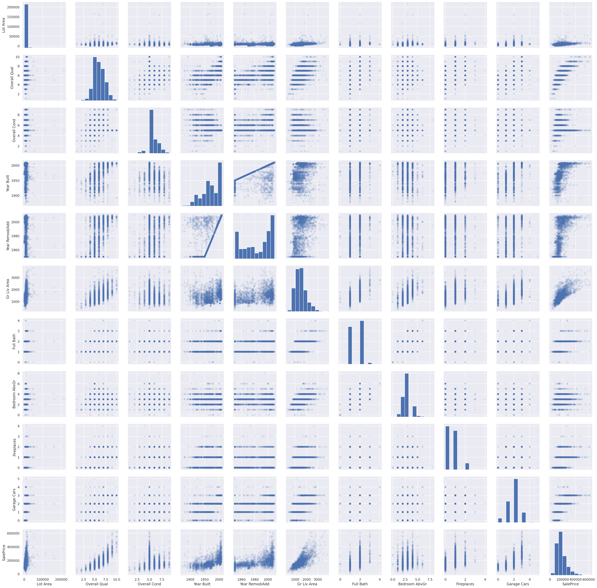

# Machine Learning Foundation

## Section 1, Part d: Feature Engineering


## Feature Engineering with Linear Regression: Applied to the Ames Housing Data

Using the Ames Housing Data:

Dean De Cock
Truman State University
Journal of Statistics Education Volume 19, Number 3(2011), [www.amstat.org/publications/jse/v19n3/decock.pdf](http://www.amstat.org/publications/jse/v19n3/decock.pdf?utm_medium=Exinfluencer&utm_source=Exinfluencer&utm_content=000026UJ&utm_term=10006555&utm_id=NA-SkillsNetwork-Channel-SkillsNetworkCoursesIBMML0232ENSkillsNetwork30654641-2022-01-01)

In this notebook, we will build some linear regression models to predict housing prices from this data. In particular, we will set out to improve on a baseline set of features via **feature engineering**: deriving new features from our existing data. Feature engineering often makes the difference between a weak model and a strong one.

We will use visual exploration, domain understanding, and intuition to construct new features that will be useful later in the course as we turn to prediction.

**Notebook Contents**

> 1.  Simple EDA
> 2.  One-hot Encoding variables
> 3.  Log transformation for skewed variables
> 4.  Pair plot for features
> 5.  Basic feature engineering: adding polynomial and interaction terms
> 6.  Feature engineering: categories and features derived from category aggregates

## 1. Simple EDA


```python
# Surpress warnings:
def warn(*args, **kwargs):
    pass
import warnings
warnings.warn = warn
```


```python
%pylab inline
%config InlineBackend.figure_formats = ['retina']

import pandas as pd
import seaborn as sns
sns.set() # setting default setting for every seaborn plot
```

    Populating the interactive namespace from numpy and matplotlib


#### Load the Data, Examine and Explore


```python
## Load in the Ames Housing Data

df = pd.read_csv("https://cf-courses-data.s3.us.cloud-object-storage.appdomain.cloud/IBM-ML0232EN-SkillsNetwork/asset/Ames_Housing_Data.tsv", sep='\t')
df.head()
```


<div>
<style scoped>
    .dataframe tbody tr th:only-of-type {
        vertical-align: middle;
    }

    .dataframe tbody tr th {
        vertical-align: top;
    }

    .dataframe thead th {
        text-align: right;
    }
</style>
<table border="1" class="dataframe">
  <thead>
    <tr style="text-align: right;">
      <th></th>
      <th>Order</th>
      <th>PID</th>
      <th>MS SubClass</th>
      <th>MS Zoning</th>
      <th>Lot Frontage</th>
      <th>Lot Area</th>
      <th>Street</th>
      <th>Alley</th>
      <th>Lot Shape</th>
      <th>Land Contour</th>
      <th>...</th>
      <th>Pool Area</th>
      <th>Pool QC</th>
      <th>Fence</th>
      <th>Misc Feature</th>
      <th>Misc Val</th>
      <th>Mo Sold</th>
      <th>Yr Sold</th>
      <th>Sale Type</th>
      <th>Sale Condition</th>
      <th>SalePrice</th>
    </tr>
  </thead>
  <tbody>
    <tr>
      <th>0</th>
      <td>1</td>
      <td>526301100</td>
      <td>20</td>
      <td>RL</td>
      <td>141.0</td>
      <td>31770</td>
      <td>Pave</td>
      <td>NaN</td>
      <td>IR1</td>
      <td>Lvl</td>
      <td>...</td>
      <td>0</td>
      <td>NaN</td>
      <td>NaN</td>
      <td>NaN</td>
      <td>0</td>
      <td>5</td>
      <td>2010</td>
      <td>WD</td>
      <td>Normal</td>
      <td>215000</td>
    </tr>
    <tr>
      <th>1</th>
      <td>2</td>
      <td>526350040</td>
      <td>20</td>
      <td>RH</td>
      <td>80.0</td>
      <td>11622</td>
      <td>Pave</td>
      <td>NaN</td>
      <td>Reg</td>
      <td>Lvl</td>
      <td>...</td>
      <td>0</td>
      <td>NaN</td>
      <td>MnPrv</td>
      <td>NaN</td>
      <td>0</td>
      <td>6</td>
      <td>2010</td>
      <td>WD</td>
      <td>Normal</td>
      <td>105000</td>
    </tr>
    <tr>
      <th>2</th>
      <td>3</td>
      <td>526351010</td>
      <td>20</td>
      <td>RL</td>
      <td>81.0</td>
      <td>14267</td>
      <td>Pave</td>
      <td>NaN</td>
      <td>IR1</td>
      <td>Lvl</td>
      <td>...</td>
      <td>0</td>
      <td>NaN</td>
      <td>NaN</td>
      <td>Gar2</td>
      <td>12500</td>
      <td>6</td>
      <td>2010</td>
      <td>WD</td>
      <td>Normal</td>
      <td>172000</td>
    </tr>
    <tr>
      <th>3</th>
      <td>4</td>
      <td>526353030</td>
      <td>20</td>
      <td>RL</td>
      <td>93.0</td>
      <td>11160</td>
      <td>Pave</td>
      <td>NaN</td>
      <td>Reg</td>
      <td>Lvl</td>
      <td>...</td>
      <td>0</td>
      <td>NaN</td>
      <td>NaN</td>
      <td>NaN</td>
      <td>0</td>
      <td>4</td>
      <td>2010</td>
      <td>WD</td>
      <td>Normal</td>
      <td>244000</td>
    </tr>
    <tr>
      <th>4</th>
      <td>5</td>
      <td>527105010</td>
      <td>60</td>
      <td>RL</td>
      <td>74.0</td>
      <td>13830</td>
      <td>Pave</td>
      <td>NaN</td>
      <td>IR1</td>
      <td>Lvl</td>
      <td>...</td>
      <td>0</td>
      <td>NaN</td>
      <td>MnPrv</td>
      <td>NaN</td>
      <td>0</td>
      <td>3</td>
      <td>2010</td>
      <td>WD</td>
      <td>Normal</td>
      <td>189900</td>
    </tr>
  </tbody>
</table>
<p>5 rows × 82 columns</p>
</div>


```python
## Examine the columns, look at missing data
df.info()
```

    <class 'pandas.core.frame.DataFrame'>
    RangeIndex: 2930 entries, 0 to 2929
    Data columns (total 82 columns):
     #   Column           Non-Null Count  Dtype  
    ---  ------           --------------  -----  
     0   Order            2930 non-null   int64  
     1   PID              2930 non-null   int64  
     2   MS SubClass      2930 non-null   int64  
     3   MS Zoning        2930 non-null   object 
     4   Lot Frontage     2440 non-null   float64
     5   Lot Area         2930 non-null   int64  
     6   Street           2930 non-null   object 
     7   Alley            198 non-null    object 
     8   Lot Shape        2930 non-null   object 
     9   Land Contour     2930 non-null   object 
     10  Utilities        2930 non-null   object 
     11  Lot Config       2930 non-null   object 
     12  Land Slope       2930 non-null   object 
     13  Neighborhood     2930 non-null   object 
     14  Condition 1      2930 non-null   object 
     15  Condition 2      2930 non-null   object 
     16  Bldg Type        2930 non-null   object 
     17  House Style      2930 non-null   object 
     18  Overall Qual     2930 non-null   int64  
     19  Overall Cond     2930 non-null   int64  
     20  Year Built       2930 non-null   int64  
     21  Year Remod/Add   2930 non-null   int64  
     22  Roof Style       2930 non-null   object 
     23  Roof Matl        2930 non-null   object 
     24  Exterior 1st     2930 non-null   object 
     25  Exterior 2nd     2930 non-null   object 
     26  Mas Vnr Type     2907 non-null   object 
     27  Mas Vnr Area     2907 non-null   float64
     28  Exter Qual       2930 non-null   object 
     29  Exter Cond       2930 non-null   object 
     30  Foundation       2930 non-null   object 
     31  Bsmt Qual        2850 non-null   object 
     32  Bsmt Cond        2850 non-null   object 
     33  Bsmt Exposure    2847 non-null   object 
     34  BsmtFin Type 1   2850 non-null   object 
     35  BsmtFin SF 1     2929 non-null   float64
     36  BsmtFin Type 2   2849 non-null   object 
     37  BsmtFin SF 2     2929 non-null   float64
     38  Bsmt Unf SF      2929 non-null   float64
     39  Total Bsmt SF    2929 non-null   float64
     40  Heating          2930 non-null   object 
     41  Heating QC       2930 non-null   object 
     42  Central Air      2930 non-null   object 
     43  Electrical       2929 non-null   object 
     44  1st Flr SF       2930 non-null   int64  
     45  2nd Flr SF       2930 non-null   int64  
     46  Low Qual Fin SF  2930 non-null   int64  
     47  Gr Liv Area      2930 non-null   int64  
     48  Bsmt Full Bath   2928 non-null   float64
     49  Bsmt Half Bath   2928 non-null   float64
     50  Full Bath        2930 non-null   int64  
     51  Half Bath        2930 non-null   int64  
     52  Bedroom AbvGr    2930 non-null   int64  
     53  Kitchen AbvGr    2930 non-null   int64  
     54  Kitchen Qual     2930 non-null   object 
     55  TotRms AbvGrd    2930 non-null   int64  
     56  Functional       2930 non-null   object 
     57  Fireplaces       2930 non-null   int64  
     58  Fireplace Qu     1508 non-null   object 
     59  Garage Type      2773 non-null   object 
     60  Garage Yr Blt    2771 non-null   float64
     61  Garage Finish    2771 non-null   object 
     62  Garage Cars      2929 non-null   float64
     63  Garage Area      2929 non-null   float64
     64  Garage Qual      2771 non-null   object 
     65  Garage Cond      2771 non-null   object 
     66  Paved Drive      2930 non-null   object 
     67  Wood Deck SF     2930 non-null   int64  
     68  Open Porch SF    2930 non-null   int64  
     69  Enclosed Porch   2930 non-null   int64  
     70  3Ssn Porch       2930 non-null   int64  
     71  Screen Porch     2930 non-null   int64  
     72  Pool Area        2930 non-null   int64  
     73  Pool QC          13 non-null     object 
     74  Fence            572 non-null    object 
     75  Misc Feature     106 non-null    object 
     76  Misc Val         2930 non-null   int64  
     77  Mo Sold          2930 non-null   int64  
     78  Yr Sold          2930 non-null   int64  
     79  Sale Type        2930 non-null   object 
     80  Sale Condition   2930 non-null   object 
     81  SalePrice        2930 non-null   int64  
    dtypes: float64(11), int64(28), object(43)
    memory usage: 1.8+ MB


```python
df['Gr Liv Area'].plot()
```


    <AxesSubplot:>


    

    


```python
# This is recommended by the data set author to remove a few outliers

df = df.loc[df['Gr Liv Area'] <= 4000,:]
print("Number of rows in the data:", df.shape[0])
print("Number of columns in the data:", df.shape[1])
data = df.copy() # Keep a copy our original data 
```

    Number of rows in the data: 2925
    Number of columns in the data: 82


```python
# A quick look at the data:
df.head()
```


<div>
<style scoped>
    .dataframe tbody tr th:only-of-type {
        vertical-align: middle;
    }

    .dataframe tbody tr th {
        vertical-align: top;
    }

    .dataframe thead th {
        text-align: right;
    }
</style>
<table border="1" class="dataframe">
  <thead>
    <tr style="text-align: right;">
      <th></th>
      <th>Order</th>
      <th>PID</th>
      <th>MS SubClass</th>
      <th>MS Zoning</th>
      <th>Lot Frontage</th>
      <th>Lot Area</th>
      <th>Street</th>
      <th>Alley</th>
      <th>Lot Shape</th>
      <th>Land Contour</th>
      <th>...</th>
      <th>Pool Area</th>
      <th>Pool QC</th>
      <th>Fence</th>
      <th>Misc Feature</th>
      <th>Misc Val</th>
      <th>Mo Sold</th>
      <th>Yr Sold</th>
      <th>Sale Type</th>
      <th>Sale Condition</th>
      <th>SalePrice</th>
    </tr>
  </thead>
  <tbody>
    <tr>
      <th>0</th>
      <td>1</td>
      <td>526301100</td>
      <td>20</td>
      <td>RL</td>
      <td>141.0</td>
      <td>31770</td>
      <td>Pave</td>
      <td>NaN</td>
      <td>IR1</td>
      <td>Lvl</td>
      <td>...</td>
      <td>0</td>
      <td>NaN</td>
      <td>NaN</td>
      <td>NaN</td>
      <td>0</td>
      <td>5</td>
      <td>2010</td>
      <td>WD</td>
      <td>Normal</td>
      <td>215000</td>
    </tr>
    <tr>
      <th>1</th>
      <td>2</td>
      <td>526350040</td>
      <td>20</td>
      <td>RH</td>
      <td>80.0</td>
      <td>11622</td>
      <td>Pave</td>
      <td>NaN</td>
      <td>Reg</td>
      <td>Lvl</td>
      <td>...</td>
      <td>0</td>
      <td>NaN</td>
      <td>MnPrv</td>
      <td>NaN</td>
      <td>0</td>
      <td>6</td>
      <td>2010</td>
      <td>WD</td>
      <td>Normal</td>
      <td>105000</td>
    </tr>
    <tr>
      <th>2</th>
      <td>3</td>
      <td>526351010</td>
      <td>20</td>
      <td>RL</td>
      <td>81.0</td>
      <td>14267</td>
      <td>Pave</td>
      <td>NaN</td>
      <td>IR1</td>
      <td>Lvl</td>
      <td>...</td>
      <td>0</td>
      <td>NaN</td>
      <td>NaN</td>
      <td>Gar2</td>
      <td>12500</td>
      <td>6</td>
      <td>2010</td>
      <td>WD</td>
      <td>Normal</td>
      <td>172000</td>
    </tr>
    <tr>
      <th>3</th>
      <td>4</td>
      <td>526353030</td>
      <td>20</td>
      <td>RL</td>
      <td>93.0</td>
      <td>11160</td>
      <td>Pave</td>
      <td>NaN</td>
      <td>Reg</td>
      <td>Lvl</td>
      <td>...</td>
      <td>0</td>
      <td>NaN</td>
      <td>NaN</td>
      <td>NaN</td>
      <td>0</td>
      <td>4</td>
      <td>2010</td>
      <td>WD</td>
      <td>Normal</td>
      <td>244000</td>
    </tr>
    <tr>
      <th>4</th>
      <td>5</td>
      <td>527105010</td>
      <td>60</td>
      <td>RL</td>
      <td>74.0</td>
      <td>13830</td>
      <td>Pave</td>
      <td>NaN</td>
      <td>IR1</td>
      <td>Lvl</td>
      <td>...</td>
      <td>0</td>
      <td>NaN</td>
      <td>MnPrv</td>
      <td>NaN</td>
      <td>0</td>
      <td>3</td>
      <td>2010</td>
      <td>WD</td>
      <td>Normal</td>
      <td>189900</td>
    </tr>
  </tbody>
</table>
<p>5 rows × 82 columns</p>
</div>


```python
len(df.PID)
```


    2925


```python
df.drop(['Order', 'PID'], axis ='columns', inplace=True)
df.head()
```


<div>
<style scoped>
    .dataframe tbody tr th:only-of-type {
        vertical-align: middle;
    }

    .dataframe tbody tr th {
        vertical-align: top;
    }

    .dataframe thead th {
        text-align: right;
    }
</style>
<table border="1" class="dataframe">
  <thead>
    <tr style="text-align: right;">
      <th></th>
      <th>MS SubClass</th>
      <th>MS Zoning</th>
      <th>Lot Frontage</th>
      <th>Lot Area</th>
      <th>Street</th>
      <th>Alley</th>
      <th>Lot Shape</th>
      <th>Land Contour</th>
      <th>Utilities</th>
      <th>Lot Config</th>
      <th>...</th>
      <th>Pool Area</th>
      <th>Pool QC</th>
      <th>Fence</th>
      <th>Misc Feature</th>
      <th>Misc Val</th>
      <th>Mo Sold</th>
      <th>Yr Sold</th>
      <th>Sale Type</th>
      <th>Sale Condition</th>
      <th>SalePrice</th>
    </tr>
  </thead>
  <tbody>
    <tr>
      <th>0</th>
      <td>20</td>
      <td>RL</td>
      <td>141.0</td>
      <td>31770</td>
      <td>Pave</td>
      <td>NaN</td>
      <td>IR1</td>
      <td>Lvl</td>
      <td>AllPub</td>
      <td>Corner</td>
      <td>...</td>
      <td>0</td>
      <td>NaN</td>
      <td>NaN</td>
      <td>NaN</td>
      <td>0</td>
      <td>5</td>
      <td>2010</td>
      <td>WD</td>
      <td>Normal</td>
      <td>215000</td>
    </tr>
    <tr>
      <th>1</th>
      <td>20</td>
      <td>RH</td>
      <td>80.0</td>
      <td>11622</td>
      <td>Pave</td>
      <td>NaN</td>
      <td>Reg</td>
      <td>Lvl</td>
      <td>AllPub</td>
      <td>Inside</td>
      <td>...</td>
      <td>0</td>
      <td>NaN</td>
      <td>MnPrv</td>
      <td>NaN</td>
      <td>0</td>
      <td>6</td>
      <td>2010</td>
      <td>WD</td>
      <td>Normal</td>
      <td>105000</td>
    </tr>
    <tr>
      <th>2</th>
      <td>20</td>
      <td>RL</td>
      <td>81.0</td>
      <td>14267</td>
      <td>Pave</td>
      <td>NaN</td>
      <td>IR1</td>
      <td>Lvl</td>
      <td>AllPub</td>
      <td>Corner</td>
      <td>...</td>
      <td>0</td>
      <td>NaN</td>
      <td>NaN</td>
      <td>Gar2</td>
      <td>12500</td>
      <td>6</td>
      <td>2010</td>
      <td>WD</td>
      <td>Normal</td>
      <td>172000</td>
    </tr>
    <tr>
      <th>3</th>
      <td>20</td>
      <td>RL</td>
      <td>93.0</td>
      <td>11160</td>
      <td>Pave</td>
      <td>NaN</td>
      <td>Reg</td>
      <td>Lvl</td>
      <td>AllPub</td>
      <td>Corner</td>
      <td>...</td>
      <td>0</td>
      <td>NaN</td>
      <td>NaN</td>
      <td>NaN</td>
      <td>0</td>
      <td>4</td>
      <td>2010</td>
      <td>WD</td>
      <td>Normal</td>
      <td>244000</td>
    </tr>
    <tr>
      <th>4</th>
      <td>60</td>
      <td>RL</td>
      <td>74.0</td>
      <td>13830</td>
      <td>Pave</td>
      <td>NaN</td>
      <td>IR1</td>
      <td>Lvl</td>
      <td>AllPub</td>
      <td>Inside</td>
      <td>...</td>
      <td>0</td>
      <td>NaN</td>
      <td>MnPrv</td>
      <td>NaN</td>
      <td>0</td>
      <td>3</td>
      <td>2010</td>
      <td>WD</td>
      <td>Normal</td>
      <td>189900</td>
    </tr>
  </tbody>
</table>
<p>5 rows × 80 columns</p>
</div>


We're going to first do some basic data cleaning on this data:

*   Converting categorical variables to dummies
*   Making skew variables symmetric

### One-hot encoding for dummy variables:


```python
# Get a Pd.Series consisting of all the string categoricals
one_hot_encode_cols = df.dtypes[df.dtypes == np.object]  # filtering by string categoricals
one_hot_encode_cols = one_hot_encode_cols.index.tolist()  # list of categorical fields

df[one_hot_encode_cols].head().T
```


<div>
<style scoped>
    .dataframe tbody tr th:only-of-type {
        vertical-align: middle;
    }

    .dataframe tbody tr th {
        vertical-align: top;
    }

    .dataframe thead th {
        text-align: right;
    }
</style>
<table border="1" class="dataframe">
  <thead>
    <tr style="text-align: right;">
      <th></th>
      <th>0</th>
      <th>1</th>
      <th>2</th>
      <th>3</th>
      <th>4</th>
    </tr>
  </thead>
  <tbody>
    <tr>
      <th>MS Zoning</th>
      <td>RL</td>
      <td>RH</td>
      <td>RL</td>
      <td>RL</td>
      <td>RL</td>
    </tr>
    <tr>
      <th>Street</th>
      <td>Pave</td>
      <td>Pave</td>
      <td>Pave</td>
      <td>Pave</td>
      <td>Pave</td>
    </tr>
    <tr>
      <th>Alley</th>
      <td>NaN</td>
      <td>NaN</td>
      <td>NaN</td>
      <td>NaN</td>
      <td>NaN</td>
    </tr>
    <tr>
      <th>Lot Shape</th>
      <td>IR1</td>
      <td>Reg</td>
      <td>IR1</td>
      <td>Reg</td>
      <td>IR1</td>
    </tr>
    <tr>
      <th>Land Contour</th>
      <td>Lvl</td>
      <td>Lvl</td>
      <td>Lvl</td>
      <td>Lvl</td>
      <td>Lvl</td>
    </tr>
    <tr>
      <th>Utilities</th>
      <td>AllPub</td>
      <td>AllPub</td>
      <td>AllPub</td>
      <td>AllPub</td>
      <td>AllPub</td>
    </tr>
    <tr>
      <th>Lot Config</th>
      <td>Corner</td>
      <td>Inside</td>
      <td>Corner</td>
      <td>Corner</td>
      <td>Inside</td>
    </tr>
    <tr>
      <th>Land Slope</th>
      <td>Gtl</td>
      <td>Gtl</td>
      <td>Gtl</td>
      <td>Gtl</td>
      <td>Gtl</td>
    </tr>
    <tr>
      <th>Neighborhood</th>
      <td>NAmes</td>
      <td>NAmes</td>
      <td>NAmes</td>
      <td>NAmes</td>
      <td>Gilbert</td>
    </tr>
    <tr>
      <th>Condition 1</th>
      <td>Norm</td>
      <td>Feedr</td>
      <td>Norm</td>
      <td>Norm</td>
      <td>Norm</td>
    </tr>
    <tr>
      <th>Condition 2</th>
      <td>Norm</td>
      <td>Norm</td>
      <td>Norm</td>
      <td>Norm</td>
      <td>Norm</td>
    </tr>
    <tr>
      <th>Bldg Type</th>
      <td>1Fam</td>
      <td>1Fam</td>
      <td>1Fam</td>
      <td>1Fam</td>
      <td>1Fam</td>
    </tr>
    <tr>
      <th>House Style</th>
      <td>1Story</td>
      <td>1Story</td>
      <td>1Story</td>
      <td>1Story</td>
      <td>2Story</td>
    </tr>
    <tr>
      <th>Roof Style</th>
      <td>Hip</td>
      <td>Gable</td>
      <td>Hip</td>
      <td>Hip</td>
      <td>Gable</td>
    </tr>
    <tr>
      <th>Roof Matl</th>
      <td>CompShg</td>
      <td>CompShg</td>
      <td>CompShg</td>
      <td>CompShg</td>
      <td>CompShg</td>
    </tr>
    <tr>
      <th>Exterior 1st</th>
      <td>BrkFace</td>
      <td>VinylSd</td>
      <td>Wd Sdng</td>
      <td>BrkFace</td>
      <td>VinylSd</td>
    </tr>
    <tr>
      <th>Exterior 2nd</th>
      <td>Plywood</td>
      <td>VinylSd</td>
      <td>Wd Sdng</td>
      <td>BrkFace</td>
      <td>VinylSd</td>
    </tr>
    <tr>
      <th>Mas Vnr Type</th>
      <td>Stone</td>
      <td>None</td>
      <td>BrkFace</td>
      <td>None</td>
      <td>None</td>
    </tr>
    <tr>
      <th>Exter Qual</th>
      <td>TA</td>
      <td>TA</td>
      <td>TA</td>
      <td>Gd</td>
      <td>TA</td>
    </tr>
    <tr>
      <th>Exter Cond</th>
      <td>TA</td>
      <td>TA</td>
      <td>TA</td>
      <td>TA</td>
      <td>TA</td>
    </tr>
    <tr>
      <th>Foundation</th>
      <td>CBlock</td>
      <td>CBlock</td>
      <td>CBlock</td>
      <td>CBlock</td>
      <td>PConc</td>
    </tr>
    <tr>
      <th>Bsmt Qual</th>
      <td>TA</td>
      <td>TA</td>
      <td>TA</td>
      <td>TA</td>
      <td>Gd</td>
    </tr>
    <tr>
      <th>Bsmt Cond</th>
      <td>Gd</td>
      <td>TA</td>
      <td>TA</td>
      <td>TA</td>
      <td>TA</td>
    </tr>
    <tr>
      <th>Bsmt Exposure</th>
      <td>Gd</td>
      <td>No</td>
      <td>No</td>
      <td>No</td>
      <td>No</td>
    </tr>
    <tr>
      <th>BsmtFin Type 1</th>
      <td>BLQ</td>
      <td>Rec</td>
      <td>ALQ</td>
      <td>ALQ</td>
      <td>GLQ</td>
    </tr>
    <tr>
      <th>BsmtFin Type 2</th>
      <td>Unf</td>
      <td>LwQ</td>
      <td>Unf</td>
      <td>Unf</td>
      <td>Unf</td>
    </tr>
    <tr>
      <th>Heating</th>
      <td>GasA</td>
      <td>GasA</td>
      <td>GasA</td>
      <td>GasA</td>
      <td>GasA</td>
    </tr>
    <tr>
      <th>Heating QC</th>
      <td>Fa</td>
      <td>TA</td>
      <td>TA</td>
      <td>Ex</td>
      <td>Gd</td>
    </tr>
    <tr>
      <th>Central Air</th>
      <td>Y</td>
      <td>Y</td>
      <td>Y</td>
      <td>Y</td>
      <td>Y</td>
    </tr>
    <tr>
      <th>Electrical</th>
      <td>SBrkr</td>
      <td>SBrkr</td>
      <td>SBrkr</td>
      <td>SBrkr</td>
      <td>SBrkr</td>
    </tr>
    <tr>
      <th>Kitchen Qual</th>
      <td>TA</td>
      <td>TA</td>
      <td>Gd</td>
      <td>Ex</td>
      <td>TA</td>
    </tr>
    <tr>
      <th>Functional</th>
      <td>Typ</td>
      <td>Typ</td>
      <td>Typ</td>
      <td>Typ</td>
      <td>Typ</td>
    </tr>
    <tr>
      <th>Fireplace Qu</th>
      <td>Gd</td>
      <td>NaN</td>
      <td>NaN</td>
      <td>TA</td>
      <td>TA</td>
    </tr>
    <tr>
      <th>Garage Type</th>
      <td>Attchd</td>
      <td>Attchd</td>
      <td>Attchd</td>
      <td>Attchd</td>
      <td>Attchd</td>
    </tr>
    <tr>
      <th>Garage Finish</th>
      <td>Fin</td>
      <td>Unf</td>
      <td>Unf</td>
      <td>Fin</td>
      <td>Fin</td>
    </tr>
    <tr>
      <th>Garage Qual</th>
      <td>TA</td>
      <td>TA</td>
      <td>TA</td>
      <td>TA</td>
      <td>TA</td>
    </tr>
    <tr>
      <th>Garage Cond</th>
      <td>TA</td>
      <td>TA</td>
      <td>TA</td>
      <td>TA</td>
      <td>TA</td>
    </tr>
    <tr>
      <th>Paved Drive</th>
      <td>P</td>
      <td>Y</td>
      <td>Y</td>
      <td>Y</td>
      <td>Y</td>
    </tr>
    <tr>
      <th>Pool QC</th>
      <td>NaN</td>
      <td>NaN</td>
      <td>NaN</td>
      <td>NaN</td>
      <td>NaN</td>
    </tr>
    <tr>
      <th>Fence</th>
      <td>NaN</td>
      <td>MnPrv</td>
      <td>NaN</td>
      <td>NaN</td>
      <td>MnPrv</td>
    </tr>
    <tr>
      <th>Misc Feature</th>
      <td>NaN</td>
      <td>NaN</td>
      <td>Gar2</td>
      <td>NaN</td>
      <td>NaN</td>
    </tr>
    <tr>
      <th>Sale Type</th>
      <td>WD</td>
      <td>WD</td>
      <td>WD</td>
      <td>WD</td>
      <td>WD</td>
    </tr>
    <tr>
      <th>Sale Condition</th>
      <td>Normal</td>
      <td>Normal</td>
      <td>Normal</td>
      <td>Normal</td>
      <td>Normal</td>
    </tr>
  </tbody>
</table>
</div>


We're going to first do some basic data cleaning on this data:

*   Converting categorical variables to dummies
*   Making skew variables symmetric

#### One-hot encoding the dummy variables:


```python
# Do the one hot encoding
df = pd.get_dummies(df, columns=one_hot_encode_cols, drop_first=True)
df.describe().T
```


<div>
<style scoped>
    .dataframe tbody tr th:only-of-type {
        vertical-align: middle;
    }

    .dataframe tbody tr th {
        vertical-align: top;
    }

    .dataframe thead th {
        text-align: right;
    }
</style>
<table border="1" class="dataframe">
  <thead>
    <tr style="text-align: right;">
      <th></th>
      <th>count</th>
      <th>mean</th>
      <th>std</th>
      <th>min</th>
      <th>25%</th>
      <th>50%</th>
      <th>75%</th>
      <th>max</th>
    </tr>
  </thead>
  <tbody>
    <tr>
      <th>MS SubClass</th>
      <td>2925.0</td>
      <td>57.396581</td>
      <td>42.668752</td>
      <td>20.0</td>
      <td>20.0</td>
      <td>50.0</td>
      <td>70.0</td>
      <td>190.0</td>
    </tr>
    <tr>
      <th>Lot Frontage</th>
      <td>2435.0</td>
      <td>69.023819</td>
      <td>22.710918</td>
      <td>21.0</td>
      <td>58.0</td>
      <td>68.0</td>
      <td>80.0</td>
      <td>313.0</td>
    </tr>
    <tr>
      <th>Lot Area</th>
      <td>2925.0</td>
      <td>10103.583590</td>
      <td>7781.999124</td>
      <td>1300.0</td>
      <td>7438.0</td>
      <td>9428.0</td>
      <td>11515.0</td>
      <td>215245.0</td>
    </tr>
    <tr>
      <th>Overall Qual</th>
      <td>2925.0</td>
      <td>6.088205</td>
      <td>1.402953</td>
      <td>1.0</td>
      <td>5.0</td>
      <td>6.0</td>
      <td>7.0</td>
      <td>10.0</td>
    </tr>
    <tr>
      <th>Overall Cond</th>
      <td>2925.0</td>
      <td>5.563761</td>
      <td>1.112262</td>
      <td>1.0</td>
      <td>5.0</td>
      <td>5.0</td>
      <td>6.0</td>
      <td>9.0</td>
    </tr>
    <tr>
      <th>...</th>
      <td>...</td>
      <td>...</td>
      <td>...</td>
      <td>...</td>
      <td>...</td>
      <td>...</td>
      <td>...</td>
      <td>...</td>
    </tr>
    <tr>
      <th>Sale Condition_AdjLand</th>
      <td>2925.0</td>
      <td>0.004103</td>
      <td>0.063931</td>
      <td>0.0</td>
      <td>0.0</td>
      <td>0.0</td>
      <td>0.0</td>
      <td>1.0</td>
    </tr>
    <tr>
      <th>Sale Condition_Alloca</th>
      <td>2925.0</td>
      <td>0.008205</td>
      <td>0.090225</td>
      <td>0.0</td>
      <td>0.0</td>
      <td>0.0</td>
      <td>0.0</td>
      <td>1.0</td>
    </tr>
    <tr>
      <th>Sale Condition_Family</th>
      <td>2925.0</td>
      <td>0.015726</td>
      <td>0.124437</td>
      <td>0.0</td>
      <td>0.0</td>
      <td>0.0</td>
      <td>0.0</td>
      <td>1.0</td>
    </tr>
    <tr>
      <th>Sale Condition_Normal</th>
      <td>2925.0</td>
      <td>0.824615</td>
      <td>0.380361</td>
      <td>0.0</td>
      <td>1.0</td>
      <td>1.0</td>
      <td>1.0</td>
      <td>1.0</td>
    </tr>
    <tr>
      <th>Sale Condition_Partial</th>
      <td>2925.0</td>
      <td>0.082735</td>
      <td>0.275528</td>
      <td>0.0</td>
      <td>0.0</td>
      <td>0.0</td>
      <td>0.0</td>
      <td>1.0</td>
    </tr>
  </tbody>
</table>
<p>260 rows × 8 columns</p>
</div>


### Log transforming skew variables


```python
# Create a list of float colums to check for skewing
mask = data.dtypes == np.float
float_cols = data.columns[mask]

skew_limit = 0.75 # define a limit above which we will log transform
skew_vals = data[float_cols].skew()
```


```python
# Showing the skewed columns
skew_cols = (skew_vals
             .sort_values(ascending=False)
             .to_frame()
             .rename(columns={0:'Skew'})
             .query('abs(Skew) > {}'.format(skew_limit)))

skew_cols
```


<div>
<style scoped>
    .dataframe tbody tr th:only-of-type {
        vertical-align: middle;
    }

    .dataframe tbody tr th {
        vertical-align: top;
    }

    .dataframe thead th {
        text-align: right;
    }
</style>
<table border="1" class="dataframe">
  <thead>
    <tr style="text-align: right;">
      <th></th>
      <th>Skew</th>
    </tr>
  </thead>
  <tbody>
    <tr>
      <th>BsmtFin SF 2</th>
      <td>4.135900</td>
    </tr>
    <tr>
      <th>Bsmt Half Bath</th>
      <td>3.965970</td>
    </tr>
    <tr>
      <th>Mas Vnr Area</th>
      <td>2.565458</td>
    </tr>
    <tr>
      <th>Lot Frontage</th>
      <td>1.111071</td>
    </tr>
    <tr>
      <th>Bsmt Unf SF</th>
      <td>0.925021</td>
    </tr>
    <tr>
      <th>BsmtFin SF 1</th>
      <td>0.821985</td>
    </tr>
  </tbody>
</table>
</div>


```python
# Let's look at what happens to one of these features, when we apply np.log1p visually.

# Choose a field
field = "BsmtFin SF 1"

# Create two "subplots" and a "figure" using matplotlib
fig, (ax_before, ax_after) = plt.subplots(1, 2, figsize=(10, 5))

# Create a histogram on the "ax_before" subplot
df[field].hist(ax=ax_before)

# Apply a log transformation (numpy syntax) to this column
df[field].apply(np.log1p).hist(ax=ax_after)

# Formatting of titles etc. for each subplot
ax_before.set(title='before np.log1p', ylabel='frequency', xlabel='value')
ax_after.set(title='after np.log1p', ylabel='frequency', xlabel='value')
fig.suptitle('Field "{}"'.format(field));
```


    

    


```python
# Perform the skew transformation:

for col in skew_cols.index.values:
    if col == "SalePrice":
        continue
    df[col] = df[col].apply(np.log1p)
```


```python
# We now have a larger set of potentially-useful features
df.shape
```


    (2925, 260)


```python
# There are a *lot* of variables. Let's go back to our saved original data and look at how many values are missing for each variable. 
df = data
data.isnull().sum().sort_values()
```


    Order                0
    Sale Condition       0
    Heating QC           0
    Central Air          0
    1st Flr SF           0
                      ... 
    Fireplace Qu      1422
    Fence             2354
    Alley             2727
    Misc Feature      2820
    Pool QC           2914
    Length: 82, dtype: int64


Let's pick out just a few numeric columns to illustrate basic feature transformations.


```python
smaller_df= df.loc[:,['Lot Area', 'Overall Qual', 'Overall Cond', 
                      'Year Built', 'Year Remod/Add', 'Gr Liv Area', 
                      'Full Bath', 'Bedroom AbvGr', 'Fireplaces', 
                      'Garage Cars','SalePrice']]
```


```python
# Now we can look at summary statistics of the subset data
smaller_df.describe().T
```


<div>
<style scoped>
    .dataframe tbody tr th:only-of-type {
        vertical-align: middle;
    }

    .dataframe tbody tr th {
        vertical-align: top;
    }

    .dataframe thead th {
        text-align: right;
    }
</style>
<table border="1" class="dataframe">
  <thead>
    <tr style="text-align: right;">
      <th></th>
      <th>count</th>
      <th>mean</th>
      <th>std</th>
      <th>min</th>
      <th>25%</th>
      <th>50%</th>
      <th>75%</th>
      <th>max</th>
    </tr>
  </thead>
  <tbody>
    <tr>
      <th>Lot Area</th>
      <td>2925.0</td>
      <td>10103.583590</td>
      <td>7781.999124</td>
      <td>1300.0</td>
      <td>7438.0</td>
      <td>9428.0</td>
      <td>11515.0</td>
      <td>215245.0</td>
    </tr>
    <tr>
      <th>Overall Qual</th>
      <td>2925.0</td>
      <td>6.088205</td>
      <td>1.402953</td>
      <td>1.0</td>
      <td>5.0</td>
      <td>6.0</td>
      <td>7.0</td>
      <td>10.0</td>
    </tr>
    <tr>
      <th>Overall Cond</th>
      <td>2925.0</td>
      <td>5.563761</td>
      <td>1.112262</td>
      <td>1.0</td>
      <td>5.0</td>
      <td>5.0</td>
      <td>6.0</td>
      <td>9.0</td>
    </tr>
    <tr>
      <th>Year Built</th>
      <td>2925.0</td>
      <td>1971.302906</td>
      <td>30.242474</td>
      <td>1872.0</td>
      <td>1954.0</td>
      <td>1973.0</td>
      <td>2001.0</td>
      <td>2010.0</td>
    </tr>
    <tr>
      <th>Year Remod/Add</th>
      <td>2925.0</td>
      <td>1984.234188</td>
      <td>20.861774</td>
      <td>1950.0</td>
      <td>1965.0</td>
      <td>1993.0</td>
      <td>2004.0</td>
      <td>2010.0</td>
    </tr>
    <tr>
      <th>Gr Liv Area</th>
      <td>2925.0</td>
      <td>1493.978803</td>
      <td>486.273646</td>
      <td>334.0</td>
      <td>1126.0</td>
      <td>1441.0</td>
      <td>1740.0</td>
      <td>3820.0</td>
    </tr>
    <tr>
      <th>Full Bath</th>
      <td>2925.0</td>
      <td>1.564786</td>
      <td>0.551386</td>
      <td>0.0</td>
      <td>1.0</td>
      <td>2.0</td>
      <td>2.0</td>
      <td>4.0</td>
    </tr>
    <tr>
      <th>Bedroom AbvGr</th>
      <td>2925.0</td>
      <td>2.853675</td>
      <td>0.827737</td>
      <td>0.0</td>
      <td>2.0</td>
      <td>3.0</td>
      <td>3.0</td>
      <td>8.0</td>
    </tr>
    <tr>
      <th>Fireplaces</th>
      <td>2925.0</td>
      <td>0.596923</td>
      <td>0.645349</td>
      <td>0.0</td>
      <td>0.0</td>
      <td>1.0</td>
      <td>1.0</td>
      <td>4.0</td>
    </tr>
    <tr>
      <th>Garage Cars</th>
      <td>2924.0</td>
      <td>1.765048</td>
      <td>0.759834</td>
      <td>0.0</td>
      <td>1.0</td>
      <td>2.0</td>
      <td>2.0</td>
      <td>5.0</td>
    </tr>
    <tr>
      <th>SalePrice</th>
      <td>2925.0</td>
      <td>180411.574701</td>
      <td>78554.857286</td>
      <td>12789.0</td>
      <td>129500.0</td>
      <td>160000.0</td>
      <td>213500.0</td>
      <td>625000.0</td>
    </tr>
  </tbody>
</table>
</div>


```python
smaller_df.info()
```

    <class 'pandas.core.frame.DataFrame'>
    Int64Index: 2925 entries, 0 to 2929
    Data columns (total 11 columns):
     #   Column          Non-Null Count  Dtype  
    ---  ------          --------------  -----  
     0   Lot Area        2925 non-null   int64  
     1   Overall Qual    2925 non-null   int64  
     2   Overall Cond    2925 non-null   int64  
     3   Year Built      2925 non-null   int64  
     4   Year Remod/Add  2925 non-null   int64  
     5   Gr Liv Area     2925 non-null   int64  
     6   Full Bath       2925 non-null   int64  
     7   Bedroom AbvGr   2925 non-null   int64  
     8   Fireplaces      2925 non-null   int64  
     9   Garage Cars     2924 non-null   float64
     10  SalePrice       2925 non-null   int64  
    dtypes: float64(1), int64(10)
    memory usage: 274.2 KB


```python
# There appears to be one NA in Garage Cars - we will take a simple approach and fill it with 0
smaller_df = smaller_df.fillna(0)
```


```python
smaller_df.info()
```

    <class 'pandas.core.frame.DataFrame'>
    Int64Index: 2925 entries, 0 to 2929
    Data columns (total 11 columns):
     #   Column          Non-Null Count  Dtype  
    ---  ------          --------------  -----  
     0   Lot Area        2925 non-null   int64  
     1   Overall Qual    2925 non-null   int64  
     2   Overall Cond    2925 non-null   int64  
     3   Year Built      2925 non-null   int64  
     4   Year Remod/Add  2925 non-null   int64  
     5   Gr Liv Area     2925 non-null   int64  
     6   Full Bath       2925 non-null   int64  
     7   Bedroom AbvGr   2925 non-null   int64  
     8   Fireplaces      2925 non-null   int64  
     9   Garage Cars     2925 non-null   float64
     10  SalePrice       2925 non-null   int64  
    dtypes: float64(1), int64(10)
    memory usage: 274.2 KB


### Pair plot of features

Now that we have a nice, filtered dataset, let's generate visuals to better understand the target and feature-target relationships: pairplot is great for this!


```python
sns.pairplot(smaller_df, plot_kws=dict(alpha=.1, edgecolor='none'))
```


    <seaborn.axisgrid.PairGrid at 0x7f6610c15710>


    

    


---
**Data Exploration Discussion**: 

1. What do these plots tell us about the distribution of the target?   

2. What do these plots tell us about the relationship between the features and the target? Do you think that linear regression is well-suited to this problem? Do any feature transformations come to mind?

3. What do these plots tell us about the relationship between various pairs of features? Do you think there may be any problems here? 

---


#### Suppose our target variable is the SalePrice. We can set up separate variables for features and target.


```python
#Separate our features from our target

X = smaller_df.loc[:,['Lot Area', 'Overall Qual', 'Overall Cond', 
                      'Year Built', 'Year Remod/Add', 'Gr Liv Area', 
                      'Full Bath', 'Bedroom AbvGr', 'Fireplaces', 
                      'Garage Cars']]

y = smaller_df['SalePrice']
```


```python
X.info()
```

    <class 'pandas.core.frame.DataFrame'>
    Int64Index: 2925 entries, 0 to 2929
    Data columns (total 10 columns):
     #   Column          Non-Null Count  Dtype  
    ---  ------          --------------  -----  
     0   Lot Area        2925 non-null   int64  
     1   Overall Qual    2925 non-null   int64  
     2   Overall Cond    2925 non-null   int64  
     3   Year Built      2925 non-null   int64  
     4   Year Remod/Add  2925 non-null   int64  
     5   Gr Liv Area     2925 non-null   int64  
     6   Full Bath       2925 non-null   int64  
     7   Bedroom AbvGr   2925 non-null   int64  
     8   Fireplaces      2925 non-null   int64  
     9   Garage Cars     2925 non-null   float64
    dtypes: float64(1), int64(9)
    memory usage: 315.9 KB


Now that we have feature/target data X, y ready to go, we're nearly ready to fit and evaluate a baseline model using our current feature set. We'll need to create a **train/validation split** before we fit and score the model.

Since we'll be repeatedly splitting X, y into the same train/val partitions and fitting/scoring new models as we update our feature set, we'll define a reusable function that completes all these steps, making our code/process more efficient going forward.


Great, let's go ahead and run this function on our baseline feature set and take some time to analyze the results.


### Basic feature engineering: adding polynomial and interaction terms


One of the first things that we looked for in the pairplot was evidence about the relationship between each feature and the target. In certain features like *'Overall Qual'* and *'Gr Liv Qual'*, we notice an upward-curved relationship rather than a simple linear correspondence. This suggests that we should add quadratic **polynomial terms or transformations** for those features, allowing us to express that non-linear relationship while still using linear regression as our model.

Luckily, pandas makes it quite easy to quickly add those square terms as additional features to our original feature set. We'll do so and evaluate our model again below.

As we add to our baseline set of features, we'll create a copy of the latest benchmark so that we can continue to store our older feature sets.

### Polynomial Features


```python
X2 = X.copy()

X2['OQ2'] = X2['Overall Qual'] ** 2
X2['GLA2'] = X2['Gr Liv Area'] ** 2

```

As is, each feature is treated as an independent quantity. However, there may be **interaction effects**, in which the impact of one feature may dependent on the current value of a different feature.

For example, there may be a higher premium for increasing *'Overall Qual'* for houses that were built more recently. If such a premium or a similar effect exists, a feature that multiplies *'Overall Qual'* by *'Year Built'* can help us capture it.

Another style of interaction term involves feature proprtions: for example, to get at something like quality per square foot we could divide *'Overall Qual'* by *'Lot Area'*.

Let's try adding both of these interaction terms and see how they impact the model results.

### Feature interactions


```python
X3 = X2.copy()

# multiplicative interaction
X3['OQ_x_YB'] = X3['Overall Qual'] * X3['Year Built']

# division interaction
X3['OQ_/_LA'] = X3['Overall Qual'] / X3['Lot Area']


```

***

**Interaction Feature Exercise**: What other interactions do you think might be helpful? Why?

***


### Categories and features derived from category aggregates


Incorporating **categorical features** into linear regression models is fairly straightforward: we can create a new feature column for each category value, and fill these columns with 1s and 0s to indicate which category is present for each row. This method is called **dummy variables** or **one-hot-encoding**.

We'll first explore this using the *'House Style'* feature from the original dataframe. Before going straight to dummy variables, it's a good idea to check category counts to make sure all categories have reasonable representation.


```python
data['House Style'].value_counts()
```


    1Story    1480
    2Story     869
    1.5Fin     314
    SLvl       128
    SFoyer      83
    2.5Unf      24
    1.5Unf      19
    2.5Fin       8
    Name: House Style, dtype: int64


This looks ok, and here's a quick look at how dummy features actually appear:


```python
pd.get_dummies(df['House Style'], drop_first=True).head()
```


<div>
<style scoped>
    .dataframe tbody tr th:only-of-type {
        vertical-align: middle;
    }

    .dataframe tbody tr th {
        vertical-align: top;
    }

    .dataframe thead th {
        text-align: right;
    }
</style>
<table border="1" class="dataframe">
  <thead>
    <tr style="text-align: right;">
      <th></th>
      <th>1.5Unf</th>
      <th>1Story</th>
      <th>2.5Fin</th>
      <th>2.5Unf</th>
      <th>2Story</th>
      <th>SFoyer</th>
      <th>SLvl</th>
    </tr>
  </thead>
  <tbody>
    <tr>
      <th>0</th>
      <td>0</td>
      <td>1</td>
      <td>0</td>
      <td>0</td>
      <td>0</td>
      <td>0</td>
      <td>0</td>
    </tr>
    <tr>
      <th>1</th>
      <td>0</td>
      <td>1</td>
      <td>0</td>
      <td>0</td>
      <td>0</td>
      <td>0</td>
      <td>0</td>
    </tr>
    <tr>
      <th>2</th>
      <td>0</td>
      <td>1</td>
      <td>0</td>
      <td>0</td>
      <td>0</td>
      <td>0</td>
      <td>0</td>
    </tr>
    <tr>
      <th>3</th>
      <td>0</td>
      <td>1</td>
      <td>0</td>
      <td>0</td>
      <td>0</td>
      <td>0</td>
      <td>0</td>
    </tr>
    <tr>
      <th>4</th>
      <td>0</td>
      <td>0</td>
      <td>0</td>
      <td>0</td>
      <td>1</td>
      <td>0</td>
      <td>0</td>
    </tr>
  </tbody>
</table>
</div>


We can call `pd.get_dummies()` on our entire dataset to quickly get data with all the original features and dummy variable representation of any categorical features. Let's look at some variable values.


```python
nbh_counts = df.Neighborhood.value_counts()
nbh_counts
```


    NAmes      443
    CollgCr    267
    OldTown    239
    Edwards    191
    Somerst    182
    NridgHt    166
    Gilbert    165
    Sawyer     151
    NWAmes     131
    SawyerW    125
    Mitchel    114
    BrkSide    108
    Crawfor    103
    IDOTRR      93
    Timber      72
    NoRidge     69
    StoneBr     51
    SWISU       48
    ClearCr     44
    MeadowV     37
    BrDale      30
    Blmngtn     28
    Veenker     24
    NPkVill     23
    Blueste     10
    Greens       8
    GrnHill      2
    Landmrk      1
    Name: Neighborhood, dtype: int64


For this category, let's map the few least-represented neighborhoods to an "other" category before adding the feature to our feature set and running a new benchmark.


```python
other_nbhs = list(nbh_counts[nbh_counts <= 8].index)

other_nbhs
```


    ['Greens', 'GrnHill', 'Landmrk']


```python
X4 = X3.copy()

X4['Neighborhood'] = df['Neighborhood'].replace(other_nbhs, 'Other')

```

#### Getting to fancier features

Let's close out our introduction to feature engineering by considering a more complex type of feature that may work very nicely for certain problems. It doesn't seem to add a great deal over what we have so far, but it's a style of engineering to keep in mind for the future.

We'll create features that capture where a feature value lies relative to the members of a category it belongs to. In particular, we'll calculate deviance of a row's feature value from the mean value of the category that row belongs to. This helps to capture information about a feature relative to the category's distribution, e.g. how nice a house is relative to other houses in its neighborhood or of its style.

Below we define reusable code for generating features of this form, feel free to repurpose it for future feature engineering work!


```python
def add_deviation_feature(X, feature, category):
    
    # temp groupby object
    category_gb = X.groupby(category)[feature]
    
    # create category means and standard deviations for each observation
    category_mean = category_gb.transform(lambda x: x.mean())
    category_std = category_gb.transform(lambda x: x.std())
    
    # compute stds from category mean for each feature value,
    # add to X as new feature
    deviation_feature = (X[feature] - category_mean) / category_std 
    X[feature + '_Dev_' + category] = deviation_feature  
```

And now let's use our feature generation code to add 2 new deviation features, and run a final benchmark.


```python
X5 = X4.copy()
X5['House Style'] = df['House Style']
add_deviation_feature(X5, 'Year Built', 'House Style')
add_deviation_feature(X5, 'Overall Qual', 'Neighborhood')

```

## Polynomial Features in Scikit-Learn

`sklearn` allows you to build many higher-order terms at once with `PolynomialFeatures`


```python
from sklearn.preprocessing import PolynomialFeatures
```


```python
#Instantiate and provide desired degree; 
#   Note: degree=2 also includes intercept, degree 1 terms, and cross-terms

pf = PolynomialFeatures(degree=2)
```


```python
features = ['Lot Area', 'Overall Qual']
pf.fit(df[features])
```


    PolynomialFeatures(degree=2, include_bias=True, interaction_only=False)


```python
pf.get_feature_names()  #Must add input_features = features for appropriate names
```


    ['1', 'x0', 'x1', 'x0^2', 'x0 x1', 'x1^2']


```python
feat_array = pf.transform(df[features])
pd.DataFrame(feat_array, columns = pf.get_feature_names(input_features=features))
```


<div>
<style scoped>
    .dataframe tbody tr th:only-of-type {
        vertical-align: middle;
    }

    .dataframe tbody tr th {
        vertical-align: top;
    }

    .dataframe thead th {
        text-align: right;
    }
</style>
<table border="1" class="dataframe">
  <thead>
    <tr style="text-align: right;">
      <th></th>
      <th>1</th>
      <th>Lot Area</th>
      <th>Overall Qual</th>
      <th>Lot Area^2</th>
      <th>Lot Area Overall Qual</th>
      <th>Overall Qual^2</th>
    </tr>
  </thead>
  <tbody>
    <tr>
      <th>0</th>
      <td>1.0</td>
      <td>31770.0</td>
      <td>6.0</td>
      <td>1.009333e+09</td>
      <td>190620.0</td>
      <td>36.0</td>
    </tr>
    <tr>
      <th>1</th>
      <td>1.0</td>
      <td>11622.0</td>
      <td>5.0</td>
      <td>1.350709e+08</td>
      <td>58110.0</td>
      <td>25.0</td>
    </tr>
    <tr>
      <th>2</th>
      <td>1.0</td>
      <td>14267.0</td>
      <td>6.0</td>
      <td>2.035473e+08</td>
      <td>85602.0</td>
      <td>36.0</td>
    </tr>
    <tr>
      <th>3</th>
      <td>1.0</td>
      <td>11160.0</td>
      <td>7.0</td>
      <td>1.245456e+08</td>
      <td>78120.0</td>
      <td>49.0</td>
    </tr>
    <tr>
      <th>4</th>
      <td>1.0</td>
      <td>13830.0</td>
      <td>5.0</td>
      <td>1.912689e+08</td>
      <td>69150.0</td>
      <td>25.0</td>
    </tr>
    <tr>
      <th>...</th>
      <td>...</td>
      <td>...</td>
      <td>...</td>
      <td>...</td>
      <td>...</td>
      <td>...</td>
    </tr>
    <tr>
      <th>2920</th>
      <td>1.0</td>
      <td>7937.0</td>
      <td>6.0</td>
      <td>6.299597e+07</td>
      <td>47622.0</td>
      <td>36.0</td>
    </tr>
    <tr>
      <th>2921</th>
      <td>1.0</td>
      <td>8885.0</td>
      <td>5.0</td>
      <td>7.894322e+07</td>
      <td>44425.0</td>
      <td>25.0</td>
    </tr>
    <tr>
      <th>2922</th>
      <td>1.0</td>
      <td>10441.0</td>
      <td>5.0</td>
      <td>1.090145e+08</td>
      <td>52205.0</td>
      <td>25.0</td>
    </tr>
    <tr>
      <th>2923</th>
      <td>1.0</td>
      <td>10010.0</td>
      <td>5.0</td>
      <td>1.002001e+08</td>
      <td>50050.0</td>
      <td>25.0</td>
    </tr>
    <tr>
      <th>2924</th>
      <td>1.0</td>
      <td>9627.0</td>
      <td>7.0</td>
      <td>9.267913e+07</td>
      <td>67389.0</td>
      <td>49.0</td>
    </tr>
  </tbody>
</table>
<p>2925 rows × 6 columns</p>
</div>


## Recap

While we haven't yet turned to prediction, these feature engineering exercises set the stage. Generally, feature engineering often follows a sort of [*Pareto principle*](https://en.wikipedia.org/wiki/Pareto_principle?utm_medium=Exinfluencer&utm_source=Exinfluencer&utm_content=000026UJ&utm_term=10006555&utm_id=NA-SkillsNetwork-Channel-SkillsNetworkCoursesIBMML0232ENSkillsNetwork30654641-2022-01-01), where a large bulk of the predictive gains can be reached through adding a set of intuitive, strong features like polynomial transforms and interactions. Directly incorporating additional information like categorical variables can also be very helpful. Beyond this point, additional feature engineering can provide significant, but potentially diminishing returns. Whether it's worth it depends on the use case for the model.


***

### Machine Learning Foundation (C) 2020 IBM Corporation

