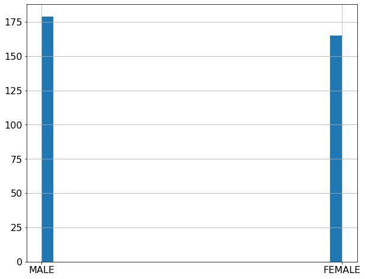
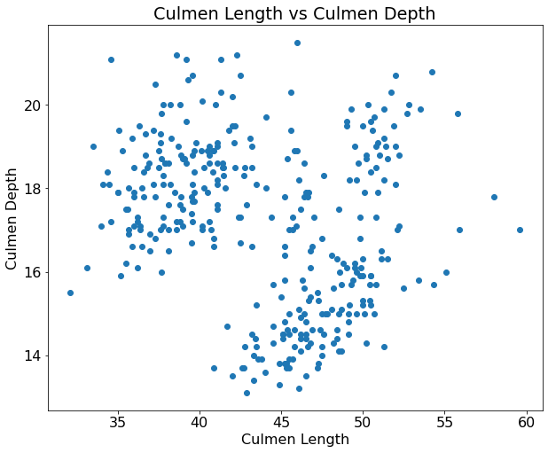
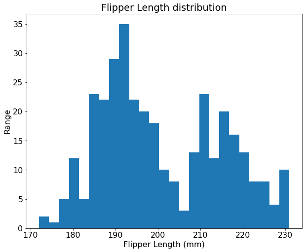
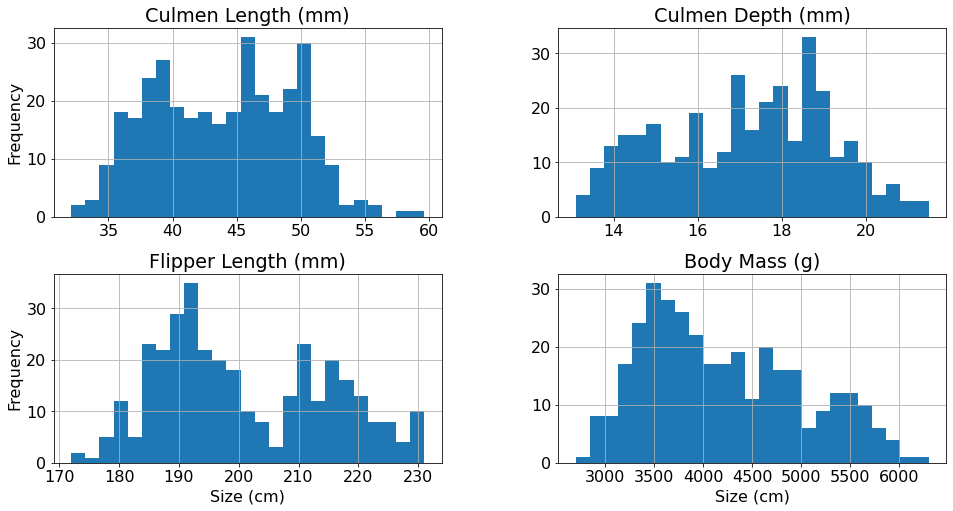
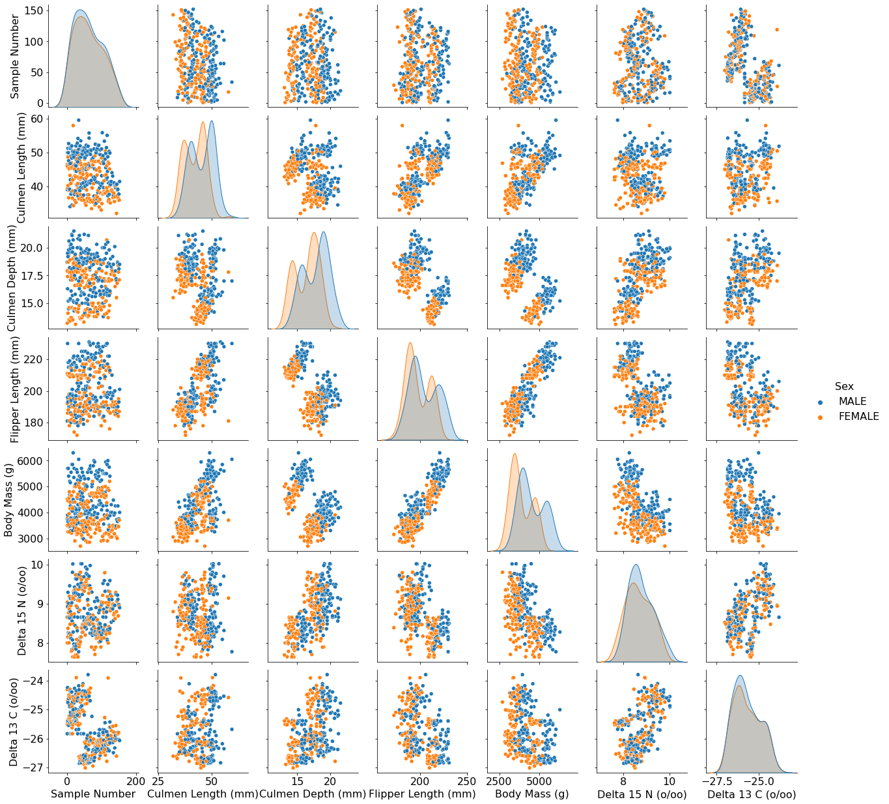
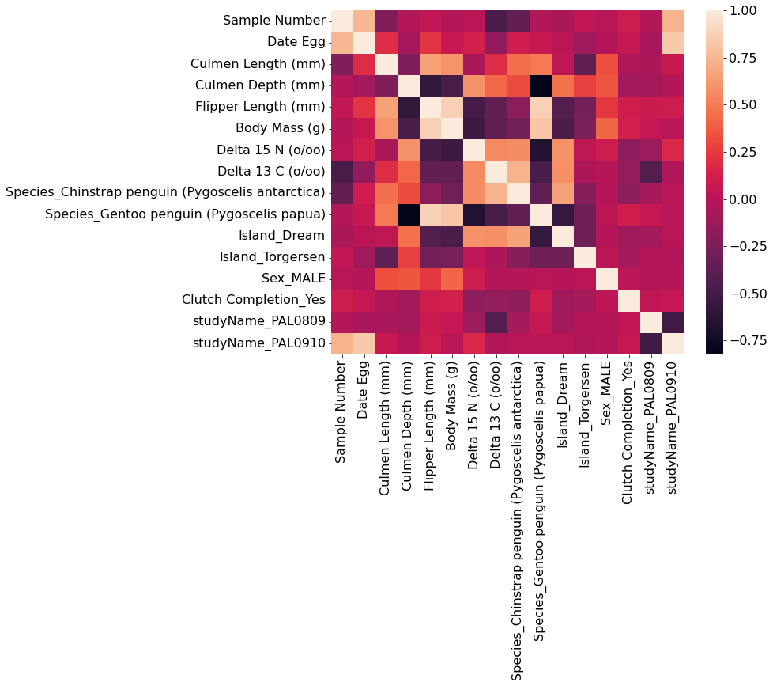
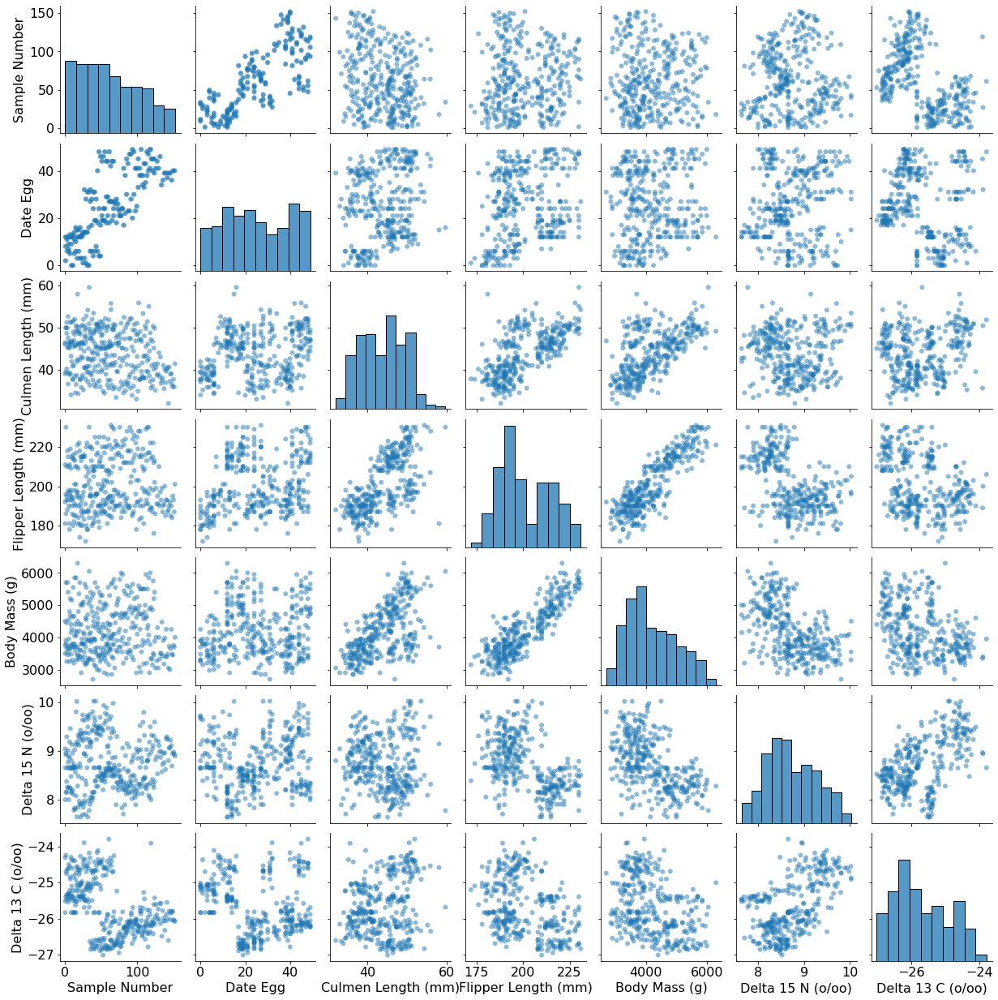

#  Palmer Archipelago (Antractica) Penguin🐧 Data

---

## Required General Libraries📚


```python
# installing opendatasets library
!pip install opendatasets
```


```python
# interacting with the system os
import os

# Data Wrangling
import numpy as np
import pandas as pd

# importing dataset from kaggle
import opendatasets as ods

# Data Visualization👀
import seaborn as sns
import plotly.express as px
import matplotlib.pyplot as plt

plt.rcParams['figure.figsize']=(10, 8)
plt.rcParams.update({
    'font.size': 14
})
```


```python
# loading data from kaggle
dataset_path = 'https://www.kaggle.com/datasets/parulpandey/palmer-archipelago-antarctica-penguin-data'
ods.download(dataset_path)
```

    Skipping, found downloaded files in "./palmer-archipelago-antarctica-penguin-data" (use force=True to force download)


```python
# redirecting to downloaded file
path = 'palmer-archipelago-antarctica-penguin-data/'
os.listdir(path)
```


    ['penguins_size.csv', 'penguins_lter.csv']


```python
# reading csv file
data = pd.read_csv(path+'penguins_lter.csv')
data.head()
```


<div>
<style scoped>
    .dataframe tbody tr th:only-of-type {
        vertical-align: middle;
    }

    .dataframe tbody tr th {
        vertical-align: top;
    }

    .dataframe thead th {
        text-align: right;
    }
</style>
<table border="1" class="dataframe">
  <thead>
    <tr style="text-align: right;">
      <th></th>
      <th>studyName</th>
      <th>Sample Number</th>
      <th>Species</th>
      <th>Region</th>
      <th>Island</th>
      <th>Stage</th>
      <th>Individual ID</th>
      <th>Clutch Completion</th>
      <th>Date Egg</th>
      <th>Culmen Length (mm)</th>
      <th>Culmen Depth (mm)</th>
      <th>Flipper Length (mm)</th>
      <th>Body Mass (g)</th>
      <th>Sex</th>
      <th>Delta 15 N (o/oo)</th>
      <th>Delta 13 C (o/oo)</th>
      <th>Comments</th>
    </tr>
  </thead>
  <tbody>
    <tr>
      <th>0</th>
      <td>PAL0708</td>
      <td>1</td>
      <td>Adelie Penguin (Pygoscelis adeliae)</td>
      <td>Anvers</td>
      <td>Torgersen</td>
      <td>Adult, 1 Egg Stage</td>
      <td>N1A1</td>
      <td>Yes</td>
      <td>11/11/07</td>
      <td>39.1</td>
      <td>18.7</td>
      <td>181.0</td>
      <td>3750.0</td>
      <td>MALE</td>
      <td>NaN</td>
      <td>NaN</td>
      <td>Not enough blood for isotopes.</td>
    </tr>
    <tr>
      <th>1</th>
      <td>PAL0708</td>
      <td>2</td>
      <td>Adelie Penguin (Pygoscelis adeliae)</td>
      <td>Anvers</td>
      <td>Torgersen</td>
      <td>Adult, 1 Egg Stage</td>
      <td>N1A2</td>
      <td>Yes</td>
      <td>11/11/07</td>
      <td>39.5</td>
      <td>17.4</td>
      <td>186.0</td>
      <td>3800.0</td>
      <td>FEMALE</td>
      <td>8.94956</td>
      <td>-24.69454</td>
      <td>NaN</td>
    </tr>
    <tr>
      <th>2</th>
      <td>PAL0708</td>
      <td>3</td>
      <td>Adelie Penguin (Pygoscelis adeliae)</td>
      <td>Anvers</td>
      <td>Torgersen</td>
      <td>Adult, 1 Egg Stage</td>
      <td>N2A1</td>
      <td>Yes</td>
      <td>11/16/07</td>
      <td>40.3</td>
      <td>18.0</td>
      <td>195.0</td>
      <td>3250.0</td>
      <td>FEMALE</td>
      <td>8.36821</td>
      <td>-25.33302</td>
      <td>NaN</td>
    </tr>
    <tr>
      <th>3</th>
      <td>PAL0708</td>
      <td>4</td>
      <td>Adelie Penguin (Pygoscelis adeliae)</td>
      <td>Anvers</td>
      <td>Torgersen</td>
      <td>Adult, 1 Egg Stage</td>
      <td>N2A2</td>
      <td>Yes</td>
      <td>11/16/07</td>
      <td>NaN</td>
      <td>NaN</td>
      <td>NaN</td>
      <td>NaN</td>
      <td>NaN</td>
      <td>NaN</td>
      <td>NaN</td>
      <td>Adult not sampled.</td>
    </tr>
    <tr>
      <th>4</th>
      <td>PAL0708</td>
      <td>5</td>
      <td>Adelie Penguin (Pygoscelis adeliae)</td>
      <td>Anvers</td>
      <td>Torgersen</td>
      <td>Adult, 1 Egg Stage</td>
      <td>N3A1</td>
      <td>Yes</td>
      <td>11/16/07</td>
      <td>36.7</td>
      <td>19.3</td>
      <td>193.0</td>
      <td>3450.0</td>
      <td>FEMALE</td>
      <td>8.76651</td>
      <td>-25.32426</td>
      <td>NaN</td>
    </tr>
  </tbody>
</table>
</div>


```python
data.info()
```

    <class 'pandas.core.frame.DataFrame'>
    RangeIndex: 344 entries, 0 to 343
    Data columns (total 17 columns):
     #   Column               Non-Null Count  Dtype  
    ---  ------               --------------  -----  
     0   studyName            344 non-null    object 
     1   Sample Number        344 non-null    int64  
     2   Species              344 non-null    object 
     3   Region               344 non-null    object 
     4   Island               344 non-null    object 
     5   Stage                344 non-null    object 
     6   Individual ID        344 non-null    object 
     7   Clutch Completion    344 non-null    object 
     8   Date Egg             344 non-null    object 
     9   Culmen Length (mm)   342 non-null    float64
     10  Culmen Depth (mm)    342 non-null    float64
     11  Flipper Length (mm)  342 non-null    float64
     12  Body Mass (g)        342 non-null    float64
     13  Sex                  334 non-null    object 
     14  Delta 15 N (o/oo)    330 non-null    float64
     15  Delta 13 C (o/oo)    331 non-null    float64
     16  Comments             26 non-null     object 
    dtypes: float64(6), int64(1), object(10)
    memory usage: 45.8+ KB


From the above result we idea about the null values in every columns.
- The **Comments** has only 26 rows that has data out of 344 so it will be a good option to drop it.


```python
data.describe()
```


<div>
<style scoped>
    .dataframe tbody tr th:only-of-type {
        vertical-align: middle;
    }

    .dataframe tbody tr th {
        vertical-align: top;
    }

    .dataframe thead th {
        text-align: right;
    }
</style>
<table border="1" class="dataframe">
  <thead>
    <tr style="text-align: right;">
      <th></th>
      <th>Sample Number</th>
      <th>Culmen Length (mm)</th>
      <th>Culmen Depth (mm)</th>
      <th>Flipper Length (mm)</th>
      <th>Body Mass (g)</th>
      <th>Delta 15 N (o/oo)</th>
      <th>Delta 13 C (o/oo)</th>
    </tr>
  </thead>
  <tbody>
    <tr>
      <th>count</th>
      <td>344.000000</td>
      <td>342.000000</td>
      <td>342.000000</td>
      <td>342.000000</td>
      <td>342.000000</td>
      <td>330.000000</td>
      <td>331.000000</td>
    </tr>
    <tr>
      <th>mean</th>
      <td>63.151163</td>
      <td>43.921930</td>
      <td>17.151170</td>
      <td>200.915205</td>
      <td>4201.754386</td>
      <td>8.733382</td>
      <td>-25.686292</td>
    </tr>
    <tr>
      <th>std</th>
      <td>40.430199</td>
      <td>5.459584</td>
      <td>1.974793</td>
      <td>14.061714</td>
      <td>801.954536</td>
      <td>0.551770</td>
      <td>0.793961</td>
    </tr>
    <tr>
      <th>min</th>
      <td>1.000000</td>
      <td>32.100000</td>
      <td>13.100000</td>
      <td>172.000000</td>
      <td>2700.000000</td>
      <td>7.632200</td>
      <td>-27.018540</td>
    </tr>
    <tr>
      <th>25%</th>
      <td>29.000000</td>
      <td>39.225000</td>
      <td>15.600000</td>
      <td>190.000000</td>
      <td>3550.000000</td>
      <td>8.299890</td>
      <td>-26.320305</td>
    </tr>
    <tr>
      <th>50%</th>
      <td>58.000000</td>
      <td>44.450000</td>
      <td>17.300000</td>
      <td>197.000000</td>
      <td>4050.000000</td>
      <td>8.652405</td>
      <td>-25.833520</td>
    </tr>
    <tr>
      <th>75%</th>
      <td>95.250000</td>
      <td>48.500000</td>
      <td>18.700000</td>
      <td>213.000000</td>
      <td>4750.000000</td>
      <td>9.172123</td>
      <td>-25.062050</td>
    </tr>
    <tr>
      <th>max</th>
      <td>152.000000</td>
      <td>59.600000</td>
      <td>21.500000</td>
      <td>231.000000</td>
      <td>6300.000000</td>
      <td>10.025440</td>
      <td>-23.787670</td>
    </tr>
  </tbody>
</table>
</div>


```python
print( "rows:", data.shape[0] )
print( "columns:", data.shape[1] )

```

    rows: 344
    columns: 17


```python
data['Species'].value_counts()
```


    Adelie Penguin (Pygoscelis adeliae)          152
    Gentoo penguin (Pygoscelis papua)            124
    Chinstrap penguin (Pygoscelis antarctica)     68
    Name: Species, dtype: int64


we have 3 type of different penguins


```python
data.groupby('Species').mean()
```


<div>
<style scoped>
    .dataframe tbody tr th:only-of-type {
        vertical-align: middle;
    }

    .dataframe tbody tr th {
        vertical-align: top;
    }

    .dataframe thead th {
        text-align: right;
    }
</style>
<table border="1" class="dataframe">
  <thead>
    <tr style="text-align: right;">
      <th></th>
      <th>Sample Number</th>
      <th>Culmen Length (mm)</th>
      <th>Culmen Depth (mm)</th>
      <th>Flipper Length (mm)</th>
      <th>Body Mass (g)</th>
      <th>Delta 15 N (o/oo)</th>
      <th>Delta 13 C (o/oo)</th>
    </tr>
    <tr>
      <th>Species</th>
      <th></th>
      <th></th>
      <th></th>
      <th></th>
      <th></th>
      <th></th>
      <th></th>
    </tr>
  </thead>
  <tbody>
    <tr>
      <th>Adelie Penguin (Pygoscelis adeliae)</th>
      <td>76.5</td>
      <td>38.791391</td>
      <td>18.346358</td>
      <td>189.953642</td>
      <td>3700.662252</td>
      <td>8.859733</td>
      <td>-25.804194</td>
    </tr>
    <tr>
      <th>Chinstrap penguin (Pygoscelis antarctica)</th>
      <td>34.5</td>
      <td>48.833824</td>
      <td>18.420588</td>
      <td>195.823529</td>
      <td>3733.088235</td>
      <td>9.356155</td>
      <td>-24.546542</td>
    </tr>
    <tr>
      <th>Gentoo penguin (Pygoscelis papua)</th>
      <td>62.5</td>
      <td>47.504878</td>
      <td>14.982114</td>
      <td>217.186992</td>
      <td>5076.016260</td>
      <td>8.245338</td>
      <td>-26.185298</td>
    </tr>
  </tbody>
</table>
</div>


```python
data.groupby('Species').median()
```


<div>
<style scoped>
    .dataframe tbody tr th:only-of-type {
        vertical-align: middle;
    }

    .dataframe tbody tr th {
        vertical-align: top;
    }

    .dataframe thead th {
        text-align: right;
    }
</style>
<table border="1" class="dataframe">
  <thead>
    <tr style="text-align: right;">
      <th></th>
      <th>Sample Number</th>
      <th>Culmen Length (mm)</th>
      <th>Culmen Depth (mm)</th>
      <th>Flipper Length (mm)</th>
      <th>Body Mass (g)</th>
      <th>Delta 15 N (o/oo)</th>
      <th>Delta 13 C (o/oo)</th>
    </tr>
    <tr>
      <th>Species</th>
      <th></th>
      <th></th>
      <th></th>
      <th></th>
      <th></th>
      <th></th>
      <th></th>
    </tr>
  </thead>
  <tbody>
    <tr>
      <th>Adelie Penguin (Pygoscelis adeliae)</th>
      <td>76.5</td>
      <td>38.80</td>
      <td>18.40</td>
      <td>190.0</td>
      <td>3700.0</td>
      <td>8.88098</td>
      <td>-25.976960</td>
    </tr>
    <tr>
      <th>Chinstrap penguin (Pygoscelis antarctica)</th>
      <td>34.5</td>
      <td>49.55</td>
      <td>18.45</td>
      <td>196.0</td>
      <td>3700.0</td>
      <td>9.37369</td>
      <td>-24.572375</td>
    </tr>
    <tr>
      <th>Gentoo penguin (Pygoscelis papua)</th>
      <td>62.5</td>
      <td>47.30</td>
      <td>15.00</td>
      <td>216.0</td>
      <td>5000.0</td>
      <td>8.25117</td>
      <td>-26.221575</td>
    </tr>
  </tbody>
</table>
</div>


```python
data['Region'].value_counts()
```


    Anvers    344
    Name: Region, dtype: int64


```python
data['Stage'].value_counts()
```


    Adult, 1 Egg Stage    344
    Name: Stage, dtype: int64


- In this data-set there is only one one region mentioned.
- In this data-set there is only one one stage for all penguins.
<br>
if a column has a single value repeatedly then it will not benefit our modul there for we will drop it.


```python
data.drop(['Region', 'Stage', 'Comments'], axis='columns', inplace = True)
```


```python
data.head()
```


<div>
<style scoped>
    .dataframe tbody tr th:only-of-type {
        vertical-align: middle;
    }

    .dataframe tbody tr th {
        vertical-align: top;
    }

    .dataframe thead th {
        text-align: right;
    }
</style>
<table border="1" class="dataframe">
  <thead>
    <tr style="text-align: right;">
      <th></th>
      <th>studyName</th>
      <th>Sample Number</th>
      <th>Species</th>
      <th>Island</th>
      <th>Individual ID</th>
      <th>Clutch Completion</th>
      <th>Date Egg</th>
      <th>Culmen Length (mm)</th>
      <th>Culmen Depth (mm)</th>
      <th>Flipper Length (mm)</th>
      <th>Body Mass (g)</th>
      <th>Sex</th>
      <th>Delta 15 N (o/oo)</th>
      <th>Delta 13 C (o/oo)</th>
    </tr>
  </thead>
  <tbody>
    <tr>
      <th>0</th>
      <td>PAL0708</td>
      <td>1</td>
      <td>Adelie Penguin (Pygoscelis adeliae)</td>
      <td>Torgersen</td>
      <td>N1A1</td>
      <td>Yes</td>
      <td>11/11/07</td>
      <td>39.1</td>
      <td>18.7</td>
      <td>181.0</td>
      <td>3750.0</td>
      <td>MALE</td>
      <td>NaN</td>
      <td>NaN</td>
    </tr>
    <tr>
      <th>1</th>
      <td>PAL0708</td>
      <td>2</td>
      <td>Adelie Penguin (Pygoscelis adeliae)</td>
      <td>Torgersen</td>
      <td>N1A2</td>
      <td>Yes</td>
      <td>11/11/07</td>
      <td>39.5</td>
      <td>17.4</td>
      <td>186.0</td>
      <td>3800.0</td>
      <td>FEMALE</td>
      <td>8.94956</td>
      <td>-24.69454</td>
    </tr>
    <tr>
      <th>2</th>
      <td>PAL0708</td>
      <td>3</td>
      <td>Adelie Penguin (Pygoscelis adeliae)</td>
      <td>Torgersen</td>
      <td>N2A1</td>
      <td>Yes</td>
      <td>11/16/07</td>
      <td>40.3</td>
      <td>18.0</td>
      <td>195.0</td>
      <td>3250.0</td>
      <td>FEMALE</td>
      <td>8.36821</td>
      <td>-25.33302</td>
    </tr>
    <tr>
      <th>3</th>
      <td>PAL0708</td>
      <td>4</td>
      <td>Adelie Penguin (Pygoscelis adeliae)</td>
      <td>Torgersen</td>
      <td>N2A2</td>
      <td>Yes</td>
      <td>11/16/07</td>
      <td>NaN</td>
      <td>NaN</td>
      <td>NaN</td>
      <td>NaN</td>
      <td>NaN</td>
      <td>NaN</td>
      <td>NaN</td>
    </tr>
    <tr>
      <th>4</th>
      <td>PAL0708</td>
      <td>5</td>
      <td>Adelie Penguin (Pygoscelis adeliae)</td>
      <td>Torgersen</td>
      <td>N3A1</td>
      <td>Yes</td>
      <td>11/16/07</td>
      <td>36.7</td>
      <td>19.3</td>
      <td>193.0</td>
      <td>3450.0</td>
      <td>FEMALE</td>
      <td>8.76651</td>
      <td>-25.32426</td>
    </tr>
  </tbody>
</table>
</div>


---

## Missing Data


```python
data.info()
```

    <class 'pandas.core.frame.DataFrame'>
    RangeIndex: 344 entries, 0 to 343
    Data columns (total 14 columns):
     #   Column               Non-Null Count  Dtype  
    ---  ------               --------------  -----  
     0   studyName            344 non-null    object 
     1   Sample Number        344 non-null    int64  
     2   Species              344 non-null    object 
     3   Island               344 non-null    object 
     4   Individual ID        344 non-null    object 
     5   Clutch Completion    344 non-null    object 
     6   Date Egg             344 non-null    object 
     7   Culmen Length (mm)   342 non-null    float64
     8   Culmen Depth (mm)    342 non-null    float64
     9   Flipper Length (mm)  342 non-null    float64
     10  Body Mass (g)        342 non-null    float64
     11  Sex                  334 non-null    object 
     12  Delta 15 N (o/oo)    330 non-null    float64
     13  Delta 13 C (o/oo)    331 non-null    float64
    dtypes: float64(6), int64(1), object(7)
    memory usage: 37.8+ KB


```python
data['Sex'].value_counts()
```


    MALE      168
    FEMALE    165
    .           1
    Name: Sex, dtype: int64


```python
data['Sex'].unique()
```


    array(['MALE', 'FEMALE', nan, '.'], dtype=object)


Originally there are 2 types of Values **Male** and **Female**.
<br>
also there are two kind of **Null values: Nan and dot(.)** .
<br> to fill these missing value we will use **simple Imputer** from **scikit learn** library. 


```python
from sklearn.impute import SimpleImputer
from sklearn.pipeline import Pipeline

pipeline =Pipeline([
    ('impute_nan', SimpleImputer( missing_values=np.nan, strategy='most_frequent' ) ),
    ('impute_dot', SimpleImputer( missing_values='.', strategy='most_frequent' ))
])
    

sex_feature = pipeline.fit_transform( data.Sex.to_numpy().reshape(-1, 1) )

# now replacing the complete array with the sex column that has missing values
data['Sex']=sex_feature.flatten()
```


```python
data.Sex.hist(bins=25)
```


    <AxesSubplot:>


    

    


```python
data['Delta 15 N (o/oo)'] = data['Delta 15 N (o/oo)'].fillna(data['Delta 15 N (o/oo)'].median())
data['Delta 13 C (o/oo)'] = data['Delta 13 C (o/oo)'].fillna(data['Delta 13 C (o/oo)'].median())
```


```python
data.info()
```

    <class 'pandas.core.frame.DataFrame'>
    RangeIndex: 344 entries, 0 to 343
    Data columns (total 14 columns):
     #   Column               Non-Null Count  Dtype  
    ---  ------               --------------  -----  
     0   studyName            344 non-null    object 
     1   Sample Number        344 non-null    int64  
     2   Species              344 non-null    object 
     3   Island               344 non-null    object 
     4   Individual ID        344 non-null    object 
     5   Clutch Completion    344 non-null    object 
     6   Date Egg             344 non-null    object 
     7   Culmen Length (mm)   342 non-null    float64
     8   Culmen Depth (mm)    342 non-null    float64
     9   Flipper Length (mm)  342 non-null    float64
     10  Body Mass (g)        342 non-null    float64
     11  Sex                  344 non-null    object 
     12  Delta 15 N (o/oo)    344 non-null    float64
     13  Delta 13 C (o/oo)    344 non-null    float64
    dtypes: float64(6), int64(1), object(7)
    memory usage: 37.8+ KB


### Missing Data of Following Columns
- Culmen Length (mm)
- Culmen Depth (mm)
- Flipper Length (mm)
- Body Mass (g)


```python
columns = ['Culmen Length (mm)', 'Culmen Depth (mm)', 'Flipper Length (mm)', 'Body Mass (g)']
data[columns].info()
```

    <class 'pandas.core.frame.DataFrame'>
    RangeIndex: 344 entries, 0 to 343
    Data columns (total 4 columns):
     #   Column               Non-Null Count  Dtype  
    ---  ------               --------------  -----  
     0   Culmen Length (mm)   342 non-null    float64
     1   Culmen Depth (mm)    342 non-null    float64
     2   Flipper Length (mm)  342 non-null    float64
     3   Body Mass (g)        342 non-null    float64
    dtypes: float64(4)
    memory usage: 10.9 KB


in above columns we have only 2 missing columns so it is good option to drop them.


```python
data.dropna(how = 'any', axis = 'rows', inplace = True)
```


```python
data.info()
```

    <class 'pandas.core.frame.DataFrame'>
    Int64Index: 342 entries, 0 to 343
    Data columns (total 14 columns):
     #   Column               Non-Null Count  Dtype  
    ---  ------               --------------  -----  
     0   studyName            342 non-null    object 
     1   Sample Number        342 non-null    int64  
     2   Species              342 non-null    object 
     3   Island               342 non-null    object 
     4   Individual ID        342 non-null    object 
     5   Clutch Completion    342 non-null    object 
     6   Date Egg             342 non-null    object 
     7   Culmen Length (mm)   342 non-null    float64
     8   Culmen Depth (mm)    342 non-null    float64
     9   Flipper Length (mm)  342 non-null    float64
     10  Body Mass (g)        342 non-null    float64
     11  Sex                  342 non-null    object 
     12  Delta 15 N (o/oo)    342 non-null    float64
     13  Delta 13 C (o/oo)    342 non-null    float64
    dtypes: float64(6), int64(1), object(7)
    memory usage: 40.1+ KB


---


```python
# ploting Culmen Length aginst Culmen Depth using scatter plot
ax = plt.axes()

ax.scatter(data['Culmen Length (mm)'],
           data['Culmen Depth (mm)']
    )

# labaling plot
ax.set(
    xlabel='Culmen Length',
    ylabel = 'Culmen Depth',
    title = 'Culmen Length vs Culmen Depth'
    )
```


    [Text(0.5, 0, 'Culmen Length'),
     Text(0, 0.5, 'Culmen Depth'),
     Text(0.5, 1.0, 'Culmen Length vs Culmen Depth')]


    

    


```python
ax = plt.axes()
ax.hist(data['Flipper Length (mm)'], bins=25)

ax.set(
    title = 'Flipper Length distribution',
    xlabel = 'Flipper Length (mm)',
    ylabel = 'Range'
)
```


    [Text(0.5, 1.0, 'Flipper Length distribution'),
     Text(0.5, 0, 'Flipper Length (mm)'),
     Text(0, 0.5, 'Range')]


    

    


```python
columns = ['Culmen Length (mm)', 'Culmen Depth (mm)', 'Flipper Length (mm)', 'Body Mass (g)']

axList = data[columns].hist( bins = 25, figsize=(16,8) )

for ax in (axList[1][1], axList[1][0]):
    ax.set_xlabel('Size (cm)')
    
for ax in (axList[0][0], axList[1][0]):
    ax.set_ylabel('Frequency')
```


    

    


```python
sns.pairplot(data, hue= 'Sex')
```


    <seaborn.axisgrid.PairGrid at 0x1351aefb0>


    

    


## Converting Categrocial Data


```python
!pip install category-encoders
```

    Collecting category-encoders
      Downloading category_encoders-2.4.1-py2.py3-none-any.whl (80 kB)
         ━━━━━━━━━━━━━━━━━━━━━━━━━━━━━━━━━━━━━━━ 80.9/80.9 KB 439.4 kB/s eta 0:00:00a 0:00:01
    [?25hRequirement already satisfied: numpy>=1.14.0 in /Library/Frameworks/Python.framework/Versions/3.10/lib/python3.10/site-packages (from category-encoders) (1.22.2)
    Requirement already satisfied: statsmodels>=0.9.0 in /Library/Frameworks/Python.framework/Versions/3.10/lib/python3.10/site-packages (from category-encoders) (0.13.2)
    Requirement already satisfied: patsy>=0.5.1 in /Library/Frameworks/Python.framework/Versions/3.10/lib/python3.10/site-packages (from category-encoders) (0.5.2)
    Requirement already satisfied: scipy>=1.0.0 in /Library/Frameworks/Python.framework/Versions/3.10/lib/python3.10/site-packages (from category-encoders) (1.8.0)
    Requirement already satisfied: scikit-learn>=0.20.0 in /Library/Frameworks/Python.framework/Versions/3.10/lib/python3.10/site-packages (from category-encoders) (1.1.0)
    Requirement already satisfied: pandas>=0.21.1 in /Library/Frameworks/Python.framework/Versions/3.10/lib/python3.10/site-packages (from category-encoders) (1.4.1)
    Requirement already satisfied: pytz>=2020.1 in /Library/Frameworks/Python.framework/Versions/3.10/lib/python3.10/site-packages (from pandas>=0.21.1->category-encoders) (2021.3)
    Requirement already satisfied: python-dateutil>=2.8.1 in /Library/Frameworks/Python.framework/Versions/3.10/lib/python3.10/site-packages (from pandas>=0.21.1->category-encoders) (2.8.2)
    Requirement already satisfied: six in /Library/Frameworks/Python.framework/Versions/3.10/lib/python3.10/site-packages (from patsy>=0.5.1->category-encoders) (1.16.0)
    Requirement already satisfied: threadpoolctl>=2.0.0 in /Library/Frameworks/Python.framework/Versions/3.10/lib/python3.10/site-packages (from scikit-learn>=0.20.0->category-encoders) (3.1.0)
    Requirement already satisfied: joblib>=1.0.0 in /Library/Frameworks/Python.framework/Versions/3.10/lib/python3.10/site-packages (from scikit-learn>=0.20.0->category-encoders) (1.1.0)
    Requirement already satisfied: packaging>=21.3 in /Library/Frameworks/Python.framework/Versions/3.10/lib/python3.10/site-packages (from statsmodels>=0.9.0->category-encoders) (21.3)
    Requirement already satisfied: pyparsing!=3.0.5,>=2.0.2 in /Library/Frameworks/Python.framework/Versions/3.10/lib/python3.10/site-packages (from packaging>=21.3->statsmodels>=0.9.0->category-encoders) (3.0.7)
    Installing collected packages: category-encoders
    Successfully installed category-encoders-2.4.1


```python
data.studyName.value_counts()
```


    PAL0910    119
    PAL0809    114
    PAL0708    109
    Name: studyName, dtype: int64


```python
data.Species.value_counts()
```


    Adelie Penguin (Pygoscelis adeliae)          151
    Gentoo penguin (Pygoscelis papua)            123
    Chinstrap penguin (Pygoscelis antarctica)     68
    Name: Species, dtype: int64


```python
data.Island.value_counts()
```


    Biscoe       167
    Dream        124
    Torgersen     51
    Name: Island, dtype: int64


```python
len(data['Individual ID'].unique())
```


    190


```python
data['Clutch Completion'].value_counts()
```


    Yes    307
    No      35
    Name: Clutch Completion, dtype: int64


```python
data.Sex.value_counts()
```


    MALE      177
    FEMALE    165
    Name: Sex, dtype: int64


- for **Species, Island, Sex, Clutch Completion and  studyName** column we will use **get dummies** for **pandas**.


```python
columns = ['Species', 'Island', 'Sex', 'Clutch Completion', 'studyName']
numric_of_category = pd.get_dummies(data[columns], drop_first=True)
```


```python
data.drop(columns, axis='columns', inplace = True)
```


```python
data = data.join(numric_of_category)
```

we will convert **Date Egg** column to date time


```python
data['Date Egg'] = pd.to_datetime(data['Date Egg'])
```

For **Indvidual ID** we will use **Ordinal Encoder** using **scikit learn*


```python
from sklearn.preprocessing import OrdinalEncoder

encoder = OrdinalEncoder()

date_encoder = encoder.fit_transform(data['Date Egg'].to_numpy().reshape(-1, 1))

data['Date Egg']= date_encoder.flatten()
```


```python
data.info()
```

    <class 'pandas.core.frame.DataFrame'>
    Int64Index: 342 entries, 0 to 343
    Data columns (total 17 columns):
     #   Column                                             Non-Null Count  Dtype  
    ---  ------                                             --------------  -----  
     0   Sample Number                                      342 non-null    int64  
     1   Individual ID                                      342 non-null    object 
     2   Date Egg                                           342 non-null    float64
     3   Culmen Length (mm)                                 342 non-null    float64
     4   Culmen Depth (mm)                                  342 non-null    float64
     5   Flipper Length (mm)                                342 non-null    float64
     6   Body Mass (g)                                      342 non-null    float64
     7   Delta 15 N (o/oo)                                  342 non-null    float64
     8   Delta 13 C (o/oo)                                  342 non-null    float64
     9   Species_Chinstrap penguin (Pygoscelis antarctica)  342 non-null    uint8  
     10  Species_Gentoo penguin (Pygoscelis papua)          342 non-null    uint8  
     11  Island_Dream                                       342 non-null    uint8  
     12  Island_Torgersen                                   342 non-null    uint8  
     13  Sex_MALE                                           342 non-null    uint8  
     14  Clutch Completion_Yes                              342 non-null    uint8  
     15  studyName_PAL0809                                  342 non-null    uint8  
     16  studyName_PAL0910                                  342 non-null    uint8  
    dtypes: float64(7), int64(1), object(1), uint8(8)
    memory usage: 37.5+ KB


---


```python
sns.heatmap(data.corr())
```


    <AxesSubplot:>


    

    


```python
columns = ['Sample Number', 'Individual ID', 'Date Egg', 'Culmen Length (mm)', 'Flipper Length (mm)', 'Body Mass (g)', 'Delta 15 N (o/oo)', 'Delta 13 C (o/oo)']
sns.pairplot(data[columns], plot_kws=dict(alpha = 0.5, edgecolor = 'none'))
```


    <seaborn.axisgrid.PairGrid at 0x149cfb760>


    

    


```python
!sudo apt-get install pandoc
```

    Password:


```python

```
